Instructions
============
  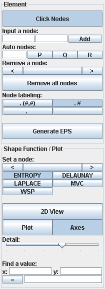   
 When the applet loads, a menubar and blank x- and y-axes are displayed. The menubar is shown at above. The applet requires at least Java JRE 1.4 to run. 
 
 The menubar provides means to enter the coordinates of any number of nodes, set a predefined pattern of nodes, remove nodes one-by-one or all at once, choose for which node the shape function should be calculated, choose a shape function formulation, and calculate the value of the shape function at any given point inside the element. There are also toggle buttons to choose whether to display a plot, the axes, and node labels, and whether to allow node placement by clicking in the plot area.

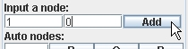

Form a square element by inputting the coordinates of its nodes. We
enter it as shown, node by node. Each node is displayed as it is
inputted.

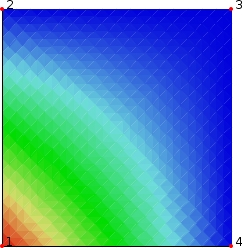

 Turn on plotting by clicking the Plot button. The shape function is
plotted, by default for the first node we entered.

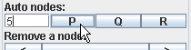

 Now click "Remove all nodes." Then use "Auto nodes" to form a regular
pentagon, as shown. 

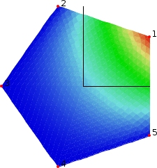

 Our pentagonal element is plotted.

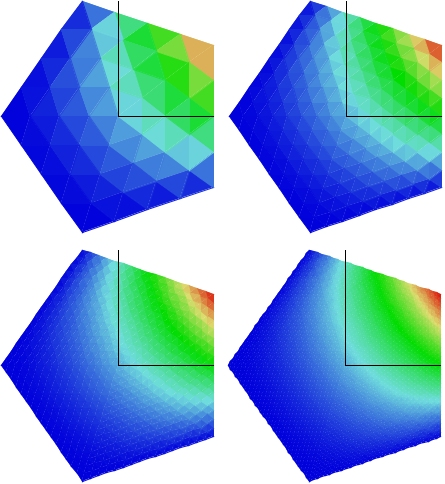

 Click the button for no node labeling. Note that we may use the Detail
slider to adjust the fineness of the plot. However, finer plots require
much more computing power to display and rotate, and may make the applet
run very slowly.

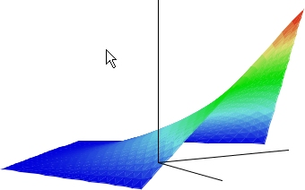

 Dragging the mouse around the plot area allows the perspective to be
changed. The mousewheel controls zooming.

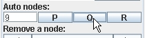

 Click "Remove all nodes" again. This time, use "Auto nodes" to form a
quadtree-type element. Alternatively, the random nodes button would form
a square element with the given number of nodes placed at random inside
it.

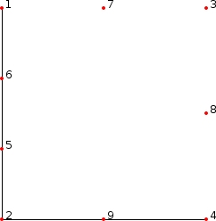

 We form an element with 9 regularly-spaced edge nodes.

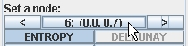

 The "Select a node" area allows us to cycle through all of the nodes
and choose the one for which to form the shape function. We choose one
of the side nodes. Note that the "Remove a node" area works very
similarly.

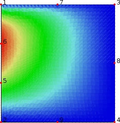

 The resulting plot.

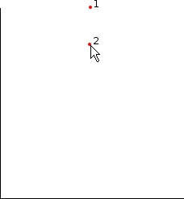

 Click "Remove all nodes" again. If "Click Nodes" is enabled, we can
input node positions by clicking on the plot itself. We can remove nodes
by right-clicking them.

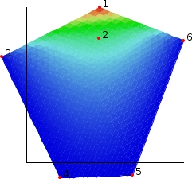

 We enter our nodes in this way, and when plotting is enabled the shape
function for the first node we formed is plotted.

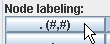

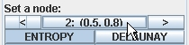

 We change node labeling and choose a different node.

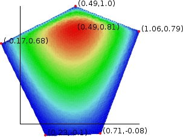

 The shape function for this interior node is plotted.

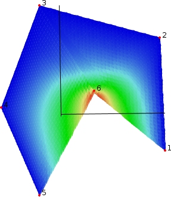

 Choosing the MVC formulation, we can form concave polygonal elements.

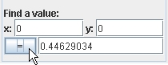

 The Function Value button allows us to find the value of the shape
function at any given point inside the element. We choose (0,0). The
value here is about halfway between zero and one, as expected from the
plot.

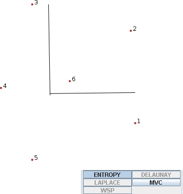

 Observe that, because the polygon has more than 3 nodes and is not
convex, many of the formulations are disabled. If we were to remove node
6 and place it outside the element, making the polygon convex, the
Wachspress formulation would be available to us again. 

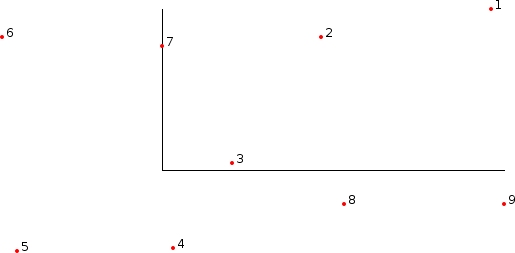

 Note also that the MVC formulation is only available for convex
polygons or simple nonconvex polygons. Shown above is a node
configuration that is neither convex nor simple (since the path
1-2-3-4-5-6-7-8-9-1 crosses itself) and therefore not suited for MVC.

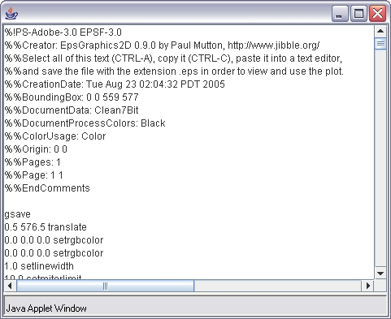

 The "Generate EPS" button creates the contents of an EPS graphics file
from the current plot. The contents are displayed in a pop-up window,
from which you can copy everything (CTRL-A, CTRL-C) and paste it into a
file (CTRL-V) to be saved with the .eps extension.

*Last update: 8/5/2006*

*This work was supported in part by the National Science Foundation
under Grant \#DMS-0135345.*

